


<a href="https://github.com/Azile-cell/Resolve-IT"></a>

<a href="https://github.com/Azile-cell/-Fikelela"></a>

<a href="https://github.com/Azile-cell/UJ-Compass"></a>

<a href="https://github.com/Azile-cell/Azile-portfolio"></a>

<a href="https://github.com/Azile-cell/AI-Productivity-Assistant"></a>

<a href="https://github.com/Azile-cell/csharp-learning-journey"></a>

<a href="https://github.com/Azile-cell/-datacamp-sql-video-games-project"></a>



<picture>
  <source media="(prefers-reduced-motion: reduce)" srcset="assets/snake-rest.svg">
  
</picture>

  


  

