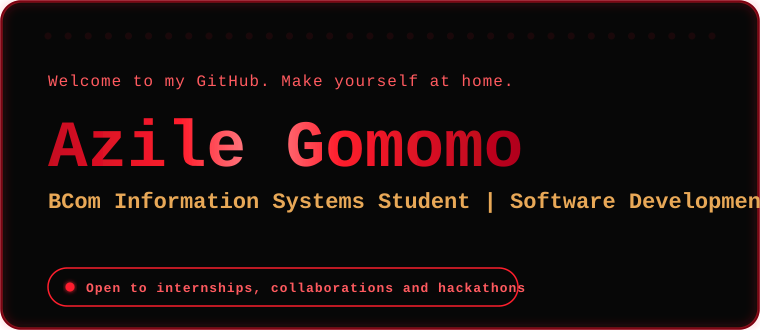

---

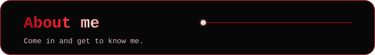

I'm a **BCom Information Systems student at the University of Johannesburg** with hands-on experience across software development, databases, data analysis and technical projects.

I have worked with **C#, ASP.NET Core, SQL, Microsoft SQL Server, JavaScript, TypeScript, Git/GitHub, Excel and Power BI**, while continuing to strengthen my skills in **Python and cloud technologies**.

I also enjoy working in collaborative technical environments. I have led student teams through hackathons and project applications, coordinated team onboarding and GitHub collaboration, and contributed to projects involving software development, UI/UX, responsible AI and product thinking.

I am currently gaining practical experience as a **Data Visualization Trainee with Excelerate** and am open to **internships, vacation work, student programmes, hackathons and collaborative technical projects**.

---

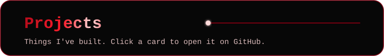
 
<a href="https://github.com/Azile-cell/Resolve-IT">
  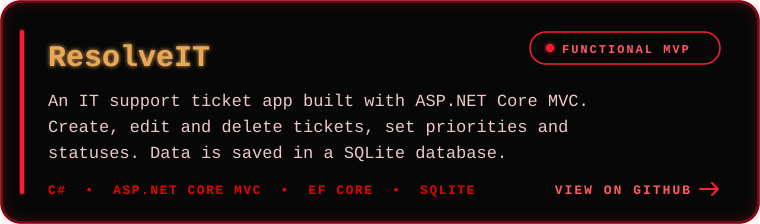
</a>
 

<a href="https://github.com/Azile-cell/UJ-Compass">
  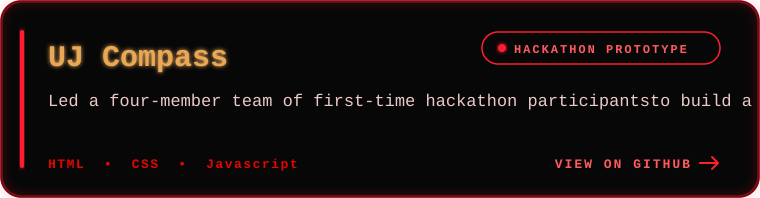
</a>
 
### WorkFlow AI — Workplace Productivity Prototype

<a href="https://github.com/Azile-cell/AI-Productivity-Assistant">
  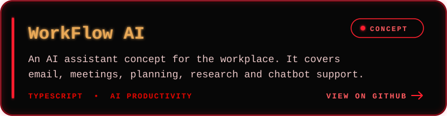
</a>

Built during the **CAPACITI AI Skills Acceleration Programme** using **Next.js, React and TypeScript**.

The prototype supports structured workflows for email drafting, meeting summaries and task prioritisation.

[Live Demo](https://ai-productivity-assistant-ebon.vercel.app/) ·
[Repository](https://github.com/Azile-cell/AI-Productivity-Assistant)

---

## More Work

<a href="https://github.com/Azile-cell/-Fikelela">
  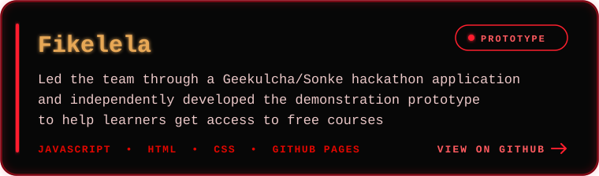
</a>
 

<a href="https://github.com/Azile-cell/-datacamp-sql-video-games-project">
  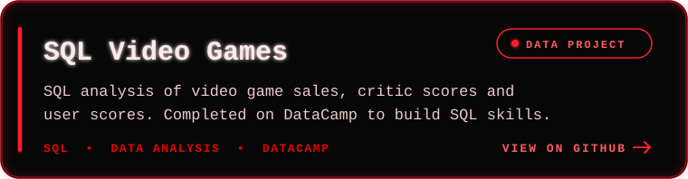
</a>
 
## Other Team Project

**Solar Esy — Cisco × WeThinkCode_ She Builds Tomorrow Hackathon**

Contributed to **problem research, UI/UX, system architecture, workflow design, prototype development and solution Q&A**.

[Team Repository](https://github.com/IT-Controll/Solar_Esy) ·
[GitHub Organisation](https://github.com/IT-Controll)

---

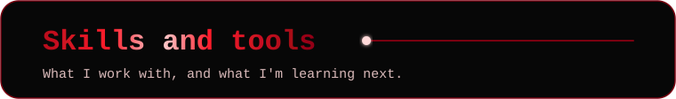

# Skills & Tools

### Programming

### Development

### Data & Cloud

### Tools

---

## Currently Developing

- Python programming
- Power BI and data modelling
- Cloud technologies
- Data analysis and visualisation
- Stronger software engineering fundamentals

---

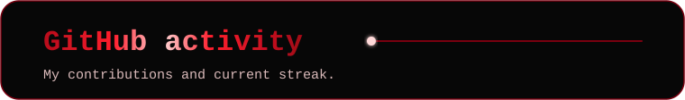

# GitHub Activity

<picture>
  <source media="(prefers-reduced-motion: reduce)" srcset="assets/snake-rest.svg">
  
</picture>

---

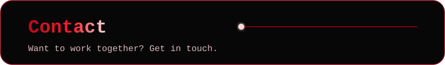

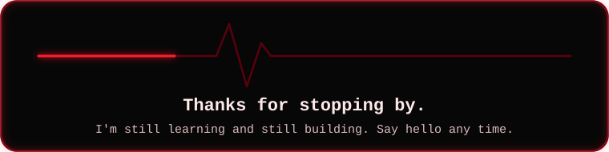
